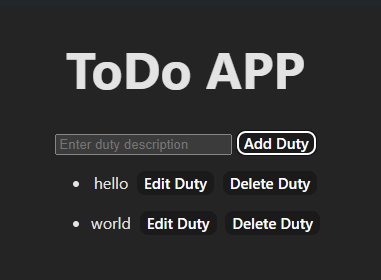
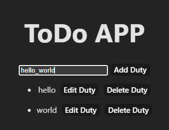
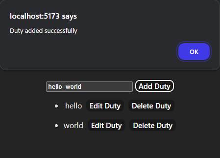
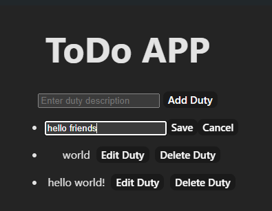
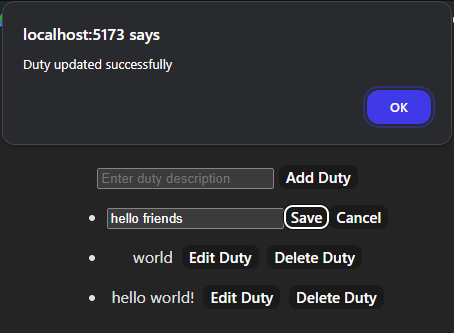
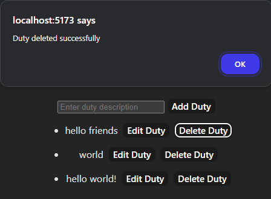
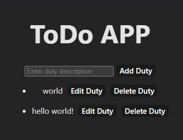

# First Step: Init postgresql database with the following information, at the file `backend/src/backend.ts`:
```javascript
const pool = new Pool({
  user: 'postgres',
  host: 'localhost',
  database: 'postgres',
  password: 'pass',
  port: 5432,
});
```

# Second Step: Install the dependencies for the backend and frontend
```bash
cd backend
npm install
cd ../frontend
npm install
```

# Third Step: Run the backend and frontend
```bash
cd backend
npm run dev
cd ../frontend
npm dev
```

# Fourth Step: Open the browser and go to the following URL
```bash
http://localhost:5173/
```

# Fifth Step: Create, Update and Delete your Duties 😊


# If you want to run the tests, you can run the following command:
```bash
cd backend
npm test
```

# FRONTEND USAGE

# Get all duties

{
    display: block;
    margin: auto;
}

# Create a duty

{
    display: block;
    margin: auto;
}

# Add created duty

{
    display: block;
    margin: auto;
}

# Update a duty

{
    display: block;
    margin: auto;
}

# Save updated duty

{
    display: block;
    margin: auto;
}

# Delete a duty

{
    display: block;
    margin: auto;
}

# After deleting duty

{
    display: block;
    margin: auto;
}